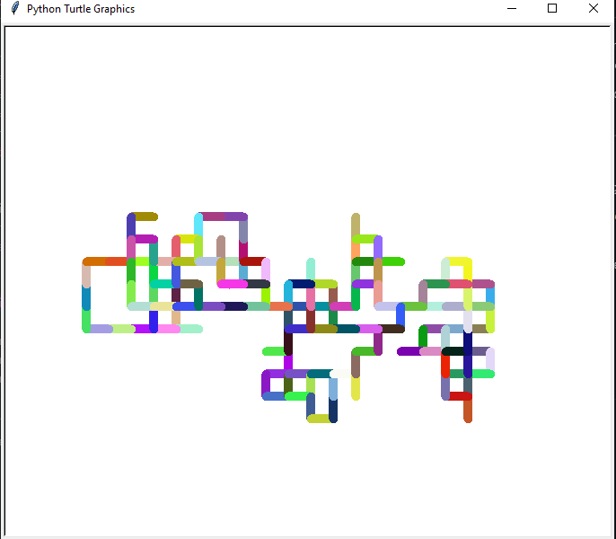

# **Random Walk Turtle**

- This is a Python program that use the Turtle module and random module to create a random walk pattern with colorful lines.

- The turtle moves forward in random directions and changes colors as it moves.

---
## _Customization:_

Feel free to customize the program as per your preferences:
- Modify the `tim.pensize()` function to change the thickness of the lines.
- Modify the `speed()` function to change the speed of turtle.
- Adjust the number in the `range()` function to control steps taken by the turtle.

